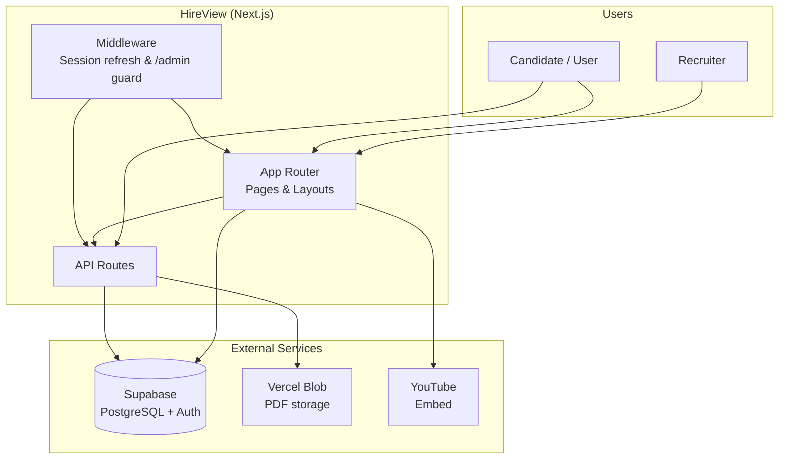
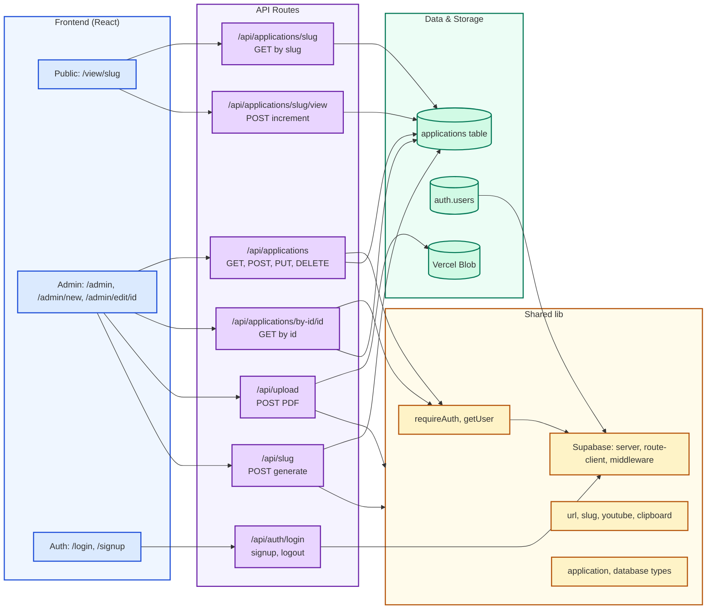
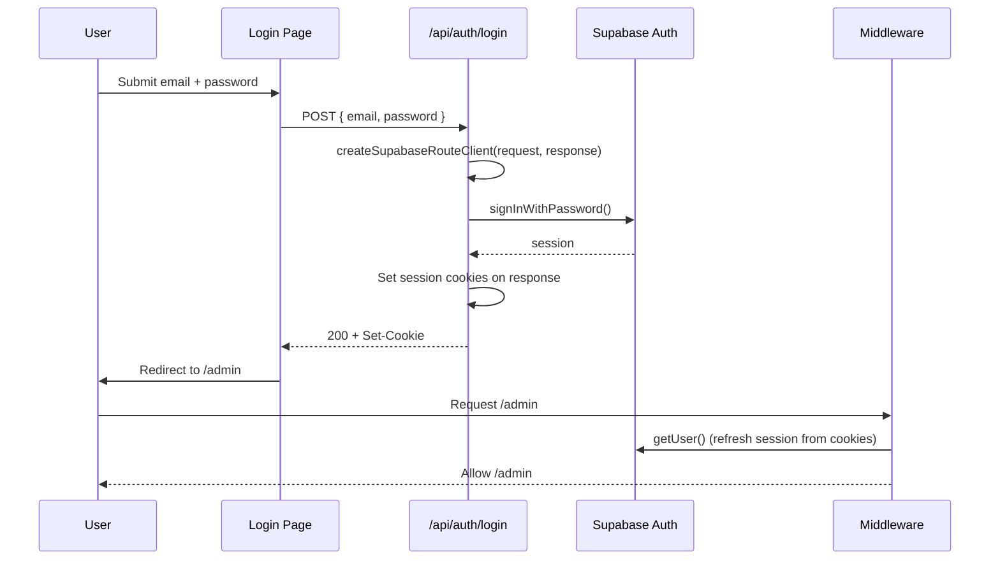
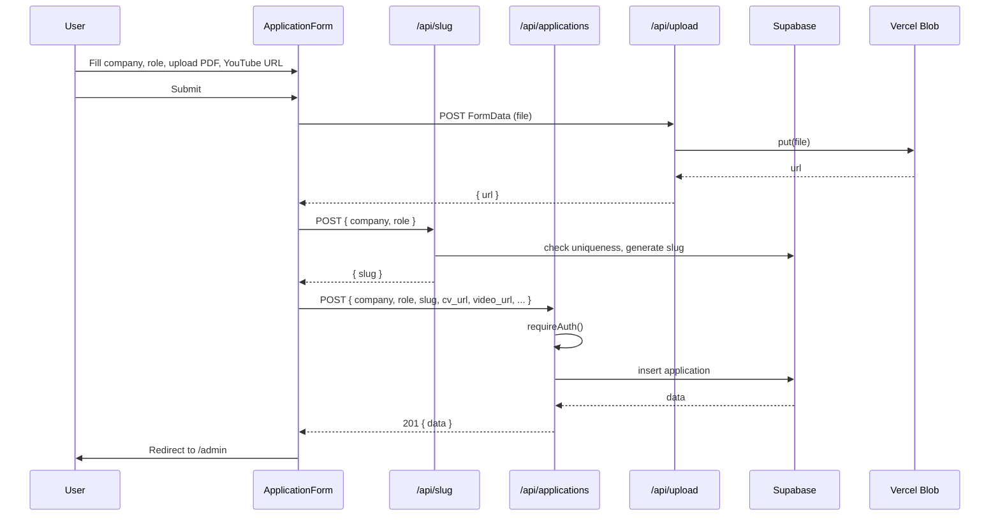
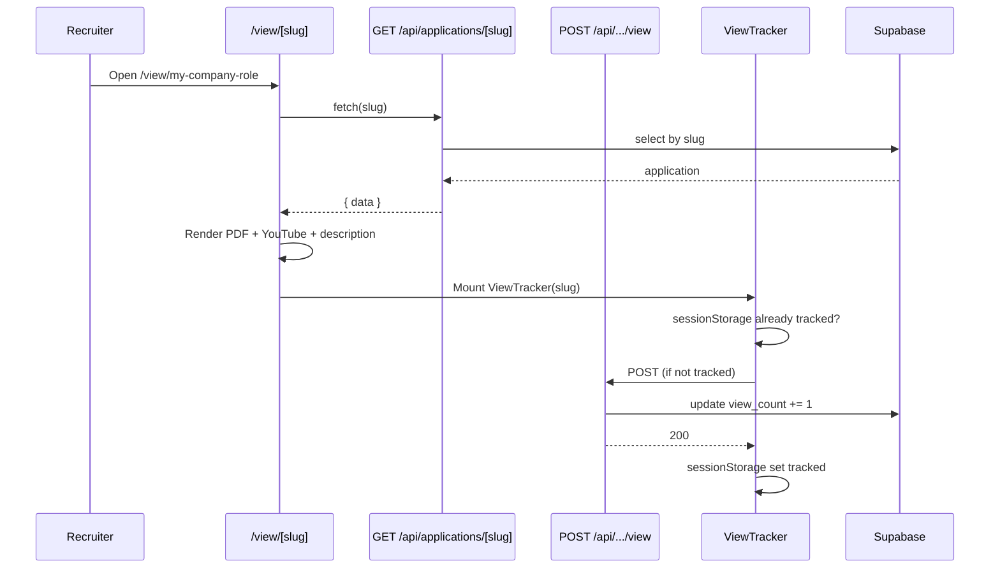

# HireView — System Architecture & Design

This document describes the architecture and design of **HireView**, an application that lets users create personalized recruiter landing pages: one shareable page per job application, with a custom CV (PDF) and video pitch (YouTube).

---

## 1. Overview

**Purpose:** Candidates create one landing page per application. Each page has a unique shareable link, shows a tailored CV (PDF), an embedded YouTube video pitch, and optional description. Recruiters open the link without logging in. Candidates manage applications from an authenticated admin dashboard and can track view counts.

**High-level behavior:**

- **Public:** Anyone with a link can view an application at `/view/[slug]`. Views are tracked (once per session).
- **Authenticated:** Users sign up / sign in, then create, edit, archive, and delete applications. They get shareable URLs and see view counts.

---

## 2. Technology Stack

| Layer            | Technology                        |
| ---------------- | --------------------------------- |
| **Framework**    | Next.js 16 (App Router)           |
| **UI**           | React 19, Tailwind CSS 4          |
| **Backend**      | Next.js API Routes (serverless)   |
| **Database**     | Supabase (PostgreSQL)             |
| **Auth**         | Supabase Auth (email/password)    |
| **File storage** | Vercel Blob (PDFs)                |
| **Video**        | YouTube (embed only; URLs stored) |

---

## 3. High-Level Architecture

The system is a single Next.js application that uses Supabase for auth and data, and Vercel Blob for CV storage. All user-facing and API logic lives in the same deployment.



- **Middleware:** Runs on each request (except static assets). Refreshes Supabase session and redirects unauthenticated users from `/admin` to `/login`.
- **App Router:** Renders pages (public apply page, admin dashboard, login/signup, home).
- **API Routes:** Handle CRUD for applications, auth (login/signup/logout), upload, slug generation, and view tracking. They enforce auth where needed and talk to Supabase and Vercel Blob.

---

## 4. Architecture Diagram — Component View



---

## 5. Layer Breakdown

### 5.1 Presentation (App Router)

| Route               | Purpose                                                                                                                         | Auth |
| ------------------- | ------------------------------------------------------------------------------------------------------------------------------- | ---- |
| `/`                 | Marketing home; when signed out: "Sign In" / "Get Started" → login; when signed in: "Dashboard" / "Go to Dashboard" → `/admin` | No   |
| `/login`, `/signup` | Auth forms; submit to `/api/auth/*`                                                                                             | No   |
| `/auth/callback`    | Supabase email confirmation / magic link; exchanges `code` for session                                                          | No   |
| `/admin`            | Dashboard: list applications, search, create/edit/archive/delete                                                                | Yes  |
| `/admin/new`        | Create application form (slug, company, role, CV upload, YouTube URL, description)                                              | Yes  |
| `/admin/edit/[id]`  | Edit existing application (same form, load by id)                                                                               | Yes  |
| `/admin/profile`    | Profile: account email, member since, application counts (all from auth + RLS-scoped queries)                                  | Yes  |
| `/view/[slug]`      | Public application page: header, PDF viewer, YouTube embed, optional description; shows “archived” state if `is_active = false` | No   |

Layouts:

- **Root (`app/layout.tsx`):** Global layout, fonts, metadata.
- **Admin (`app/admin/layout.tsx`):** Calls `requireAuth()` (redirects to `/login` if not authenticated), then renders `AdminHeader` (HireView, Dashboard, New Application, Profile, user email, Sign out) and `children`.

### 5.2 API Layer

All under `app/api/`:

| Endpoint                        | Methods                | Purpose                                                                  | Auth                                              |
| ------------------------------- | ---------------------- | ------------------------------------------------------------------------ | ------------------------------------------------- |
| `/api/applications`             | GET, POST, PUT, DELETE | List (user’s), create, update, delete application                        | Required (except N/A for unauthenticated)         |
| `/api/applications/[slug]`      | GET                    | Fetch one application by slug (public)                                   | No                                                |
| `/api/applications/[slug]/view` | POST                   | Increment `view_count` for slug                                          | No                                                |
| `/api/applications/by-id/[id]`  | GET                    | Fetch one by id (for edit page)                                          | Required                                          |
| `/api/auth/login`               | POST                   | Sign in; sets session cookies via route client                           | No                                                |
| `/api/auth/signup`              | POST                   | Sign up; sets session cookies                                            | No                                                |
| `/api/auth/logout`              | POST                   | Sign out; clears session                                                 | No                                                |
| `/api/upload`                   | POST                   | Accept PDF `FormData`, upload to Vercel Blob, return URL                 | No (consider protecting in production)            |
| `/api/slug`                     | POST                   | Generate unique slug from company + role (optional `excludeId` for edit) | No (slug generation is idempotent; consider auth) |

Auth is enforced in API handlers via `requireAuth()` from `lib/auth.ts`, which uses the Supabase server client and redirects to `/login` when used in pages; in API routes it returns 401.

### 5.3 Auth & Session

- **Provider:** Supabase Auth (email/password). Config and email templates are described in `docs/SUPABASE_AUTH_SETUP.md`.
- **Session:** Cookie-based. Supabase SSR helpers read/write cookies.
- **Clients:**
  - **Server (Server Components, server-side logic):** `lib/supabase/server.ts` — `createClient()` using `cookies()` from `next/headers`.
  - **Route handler (login/signup/logout):** `lib/supabase/route-client.ts` — `createSupabaseRouteClient({ request, response })` so the response carries `Set-Cookie` headers.
  - **Middleware:** `lib/supabase/middleware.ts` — `updateSession(request)`: refreshes session and redirects unauthenticated users from `/admin` to `/login`. Intended to be invoked from root middleware (e.g. `middleware.ts` that re-exports or calls this; current entry is `proxy.ts` with matcher config).
- **Callback:** `app/auth/callback/route.ts` — GET handler that takes `code` and `next` from query, exchanges code for session, redirects to `next` (default `/admin`).

### 5.4 Data (Supabase)

- **Single table:** `applications`
  - `id` (UUID, PK), `slug` (unique), `company`, `role`, `cv_url`, `video_url`, `description`, `created_at`, `updated_at`, `view_count`, `user_id` (FK to `auth.users`), `is_active` (default true; archiving = soft hide).
- **Indexes:** `slug`, `user_id`, `created_at DESC`.
- **RLS:** Enabled. Policies: users can SELECT/INSERT/UPDATE/DELETE their own rows; public can SELECT any row (for public apply page by slug).
- **Trigger:** `updated_at` maintained on update.

Types are mirrored in `lib/types/application.ts` and `lib/types/database.ts`.

### 5.5 File Storage (Vercel Blob)

- **Use case:** CV PDFs only.
- **Flow:** Client uploads file to `/api/upload` → API validates type (PDF) and size (e.g. 10MB) → `put()` to Vercel Blob with public access → store returned URL in `applications.cv_url`.

Video is not stored; only YouTube URLs are stored and embedded via `YouTubeEmbed` and `lib/utils/youtube.ts`.

---

## 6. Key Flows

### 6.1 Authentication (login)



### 6.2 Create application



### 6.3 Public view and view tracking



---

## 7. Security Summary

- **Auth:** Supabase handles passwords and sessions; middleware protects `/admin`; API routes use `requireAuth()` where needed.
- **Data:** RLS ensures users only modify their own applications; public read by slug is allowed by policy.
- **Upload:** PDF-only, size limit; upload route does not currently require auth (adding auth is recommended for production).
- **Slug:** Unique per application; generation is deterministic from company/role with collision handling; no sensitive data in slug.

---

## 8. Project Structure (Summary)

```
hireview/
├── app/
│   ├── layout.tsx              # Root layout
│   ├── page.tsx                # Home
│   ├── login/, signup/         # Auth pages
│   ├── auth/callback/          # Supabase OAuth/email callback
│   ├── admin/                  # Dashboard, new, edit (layout uses requireAuth)
│   ├── view/[slug]/             # Public application page + ViewTracker
│   └── api/                    # All API routes (see section 5.2)
├── components/
│   ├── admin/                  # AdminDashboardEmpty, AdminDashboardError, AdminDashboardSkeleton, AdminHeader, ApplicationCard, SearchBar
│   ├── auth/                   # SignOutButton
│   ├── forms/                  # ApplicationForm, FileUpload, YouTubeUrlInput
│   ├── pdf/                    # PDFViewer
│   ├── public/                 # ApplicationPageHeader, MarketingFeatures, MarketingHeader, MarketingHero
│   ├── ui/                     # Button, Input, Textarea
│   └── video/                  # YouTubeEmbed
├── hooks/                      # useApplications (admin dashboard state + API)
├── lib/
│   ├── api/                    # applications (client: fetch, delete, archive, restore)
│   ├── auth.ts                 # getUser, requireAuth
│   ├── supabase/               # server, route-client, middleware, client, env
│   ├── types/                  # application, database
│   └── utils/                  # url, slug, slug-generate, youtube, clipboard
├── supabase/migrations/        # 001 schema, 002 is_active
├── proxy.ts                    # Middleware entry (session + /admin guard)
└── docs/                       # ARCHITECTURE, CODE_REVIEW, SUPABASE_AUTH_SETUP
```

---

## 9. Design Decisions (Summary)

| Decision                   | Rationale                                                                                                                |
| -------------------------- | ------------------------------------------------------------------------------------------------------------------------ |
| Next.js App Router         | Single codebase for SSR, API, and client components; good fit for auth and public/private routes.                        |
| Supabase                   | Managed Postgres + Auth + RLS in one product; reduces custom backend code.                                               |
| Slug-based public URLs     | Stable, shareable links that don’t expose internal IDs; uniqueness enforced in DB and slug API.                          |
| Vercel Blob for PDFs       | Simple serverless storage; no need to run or scale file servers.                                                         |
| View count in DB           | Simple and accurate; one increment per view (deduplicated per session in ViewTracker).                                   |
| `is_active` for archive    | Soft delete: link still works but shows “archived” message; no hard delete of history.                                   |
| Route client for auth APIs | Login/signup/logout must write cookies on the response; route client is the pattern recommended by Supabase for Next.js. |

---

For setup and auth configuration, see [README.md](../README.md) and [SUPABASE_AUTH_SETUP.md](SUPABASE_AUTH_SETUP.md). For code quality and refactors, see [CODE_REVIEW.md](CODE_REVIEW.md).
