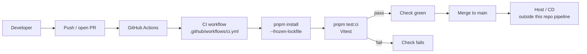

# CI/CD Pipeline

**Canonical doc** for continuous integration and delivery architecture. Update this file whenever workflows, runners, gates, or deploy steps change.

**Related:** [TESTING.md](TESTING.md) (test suite) · [PROJECT_OVERVIEW.md](PROJECT_OVERVIEW.md) · [Backlog.md](Backlog.md) (`A1-002`)

> Last updated: August 5, 2026

---

## 1. Current state (summary)

| Concern | Status |
| -------- | ------ |
| **CI** | GitHub Actions runs Vitest (`pnpm test:ci`) on PRs and pushes to `main` |
| **CD / deploy** | Not in-repo — hosting (e.g. Vercel) is separate from this pipeline |
| **Lint / typecheck / build in CI** | Not yet |
| **Branch protection** | Manual GitHub settings (require CI check before merge) — optional ops step |

Shipped as **A1-002** on branch `chore/a1-ci-cd`.

---

## 2. High-level architecture

**Design intent**

- Keep CI **fast and secret-free**: unit/API tests use mocks (no Supabase/R2 credentials required on the runner).
- One workflow file for now; split later if jobs diverge (e.g. lint vs test vs e2e).
- Deploy remains outside this doc’s “in-repo pipeline” until we codify it (Vercel project settings, preview URLs, etc.).

---

## 3. Workflow inventory

| Workflow | Path | Purpose |
| -------- | ---- | ------- |
| **CI** | [`.github/workflows/ci.yml`](../.github/workflows/ci.yml) | Install deps + run `pnpm test:ci` |

### CI workflow detail

| Field | Value |
| ----- | ----- |
| **Name** | `CI` |
| **Triggers** | `pull_request` (all branches); `push` to `main` |
| **Concurrency** | `ci-${{ github.workflow }}-${{ github.ref }}` — cancel in-progress runs on the same ref |
| **Runner** | `ubuntu-latest` |
| **Timeout** | 10 minutes |
| **Job** | `test` |

**Steps (in order)**

1. Checkout (`actions/checkout@v4`)
2. Setup pnpm (`pnpm/action-setup@v4`, version **10**)
3. Setup Node.js (`actions/setup-node@v4`, Node **22**, `cache: pnpm`)
4. `pnpm install --frozen-lockfile`
5. `pnpm test:ci` → `vitest run`

---

## 4. Tooling & versions

| Tool | Version / pin | Notes |
| ---- | ------------- | ----- |
| Node.js | 22 | Matches current local default; pin in workflow |
| pnpm | 10 | Via `pnpm/action-setup` |
| Test runner | Vitest (`pnpm test:ci`) | See [TESTING.md](TESTING.md) |
| Package lock | `pnpm-lock.yaml` | Frozen install in CI |

---

## 5. Secrets & environment

| Need | In CI today? |
| ---- | ------------ |
| Supabase / R2 / app env vars | **No** — mocked unit suite |
| GitHub token | Default `GITHUB_TOKEN` only (checkout) |

When future jobs need secrets (e.g. integration tests, deploy tokens), document them here and store them in the GitHub repo **Settings → Secrets and variables → Actions**.

---

## 6. Quality gates (product / ops)

| Gate | Where | Notes |
| ---- | ----- | ----- |
| Automated tests | GitHub Actions check `CI / test` | Must stay green on PRs |
| Require check to merge | GitHub branch protection on `main` | Not encoded in YAML; configure in GitHub UI if desired |
| Local pre-merge | `pnpm test:ci` | Same command as CI |

---

## 7. Roadmap / not yet in pipeline

Record intended additions here so this doc stays the single architecture source (tickets still live in [Backlog.md](Backlog.md)):

| Idea | Notes |
| ---- | ----- |
| `pnpm lint` | ESLint on PR |
| `pnpm build` / typecheck | Catch Next.js / TS build breaks |
| Coverage upload | Optional (`@vitest/coverage-v8` already a dep) |
| CD in-repo | Document Vercel (or other) deploy triggers, preview vs production |
| E2E | Playwright/Cypress — would need secrets / preview URL strategy |

---

## 8. Changelog

| Date | Change | Ticket / PR |
| ---- | ------ | ----------- |
| 2026-08-05 | Initial CI: GitHub Actions + `pnpm test:ci` on PR / `main` | A1-002 |
