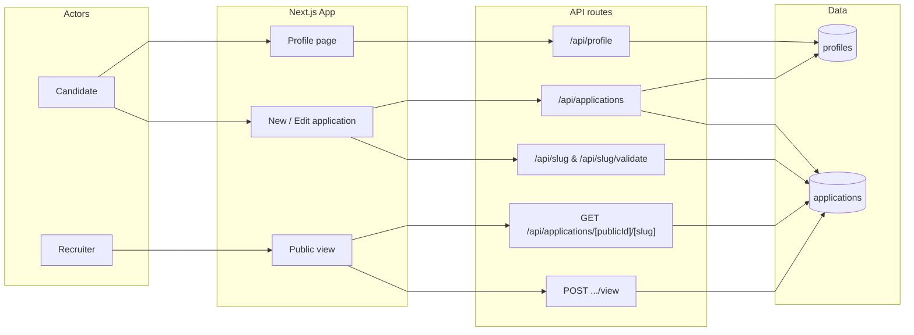
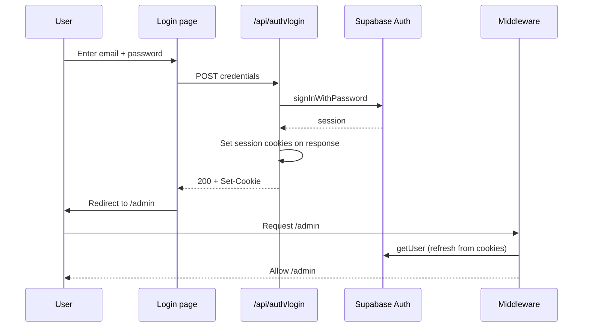
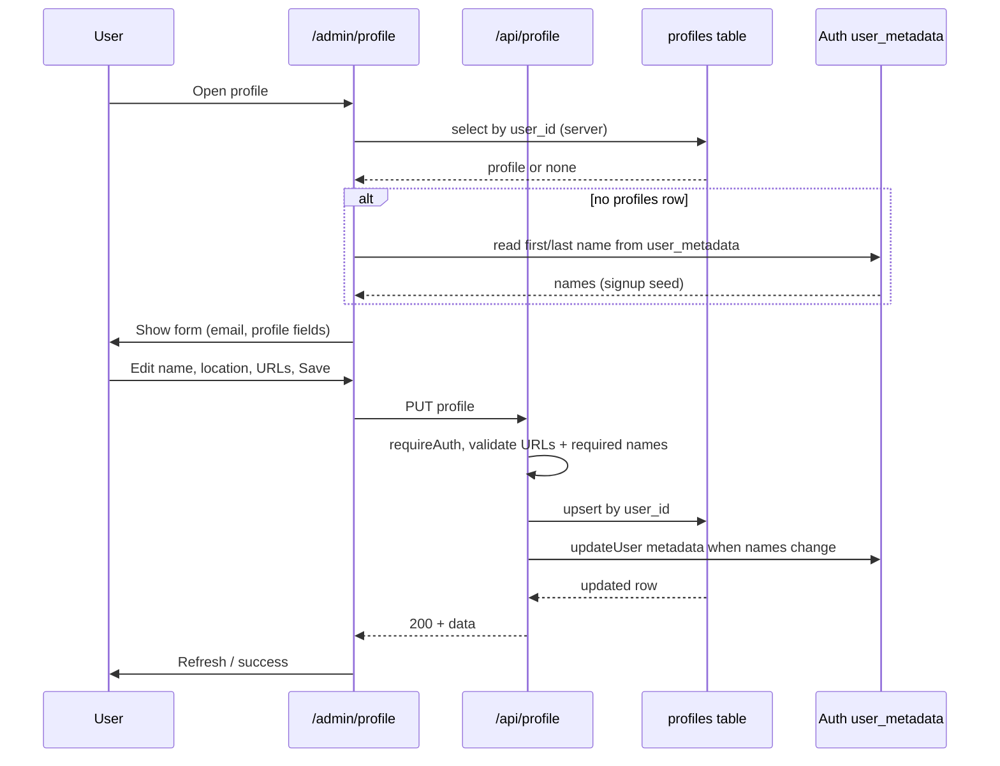
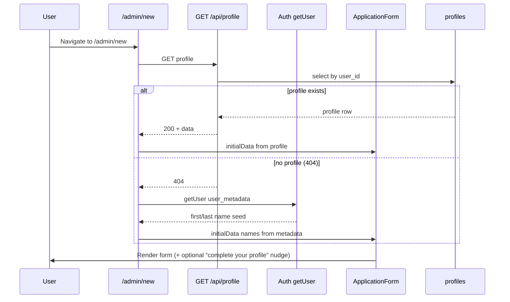
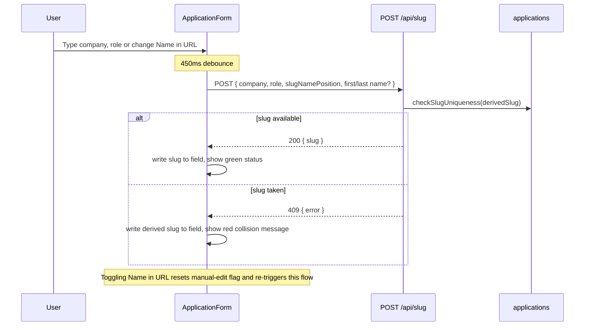
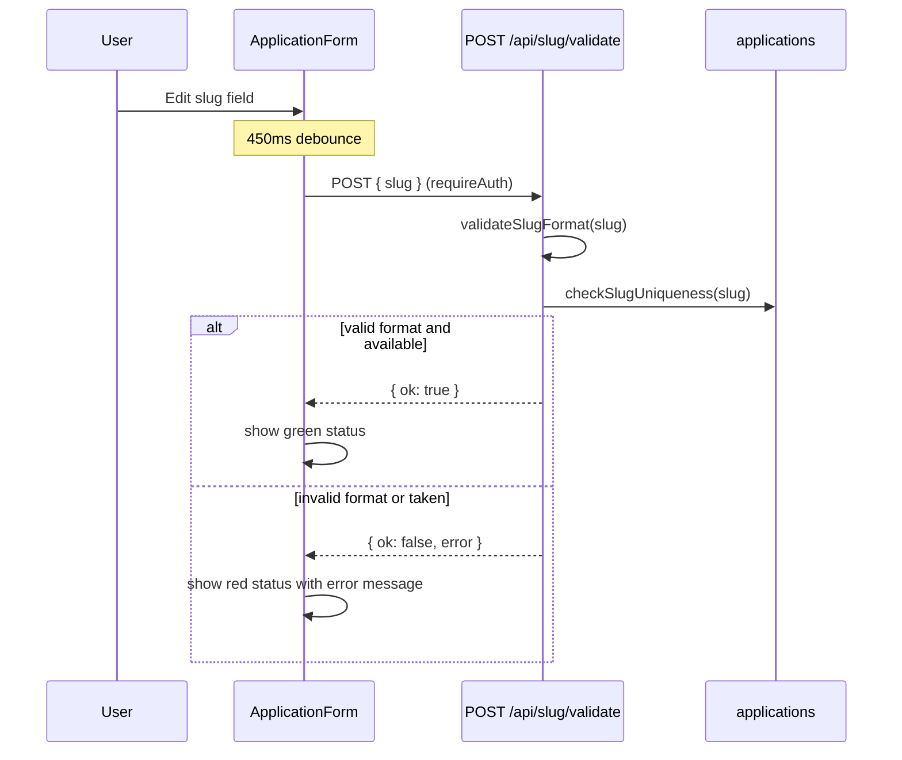
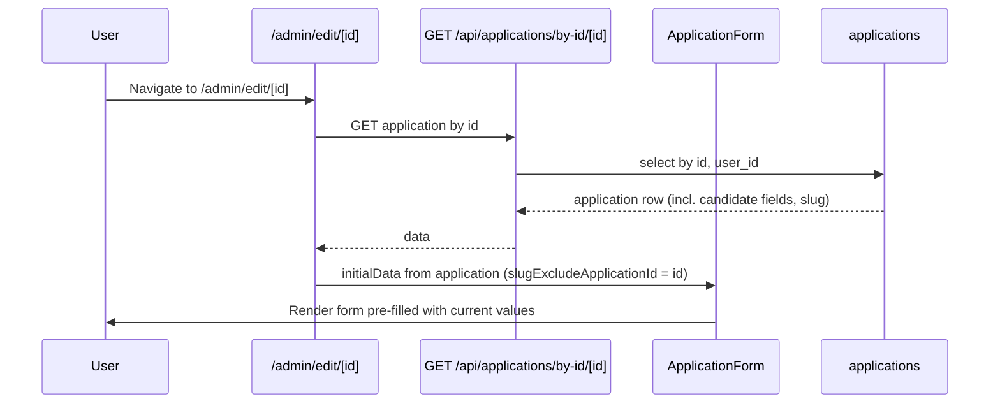
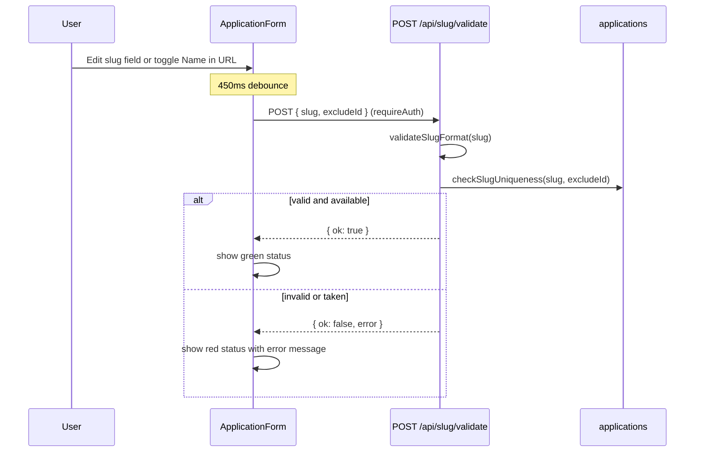
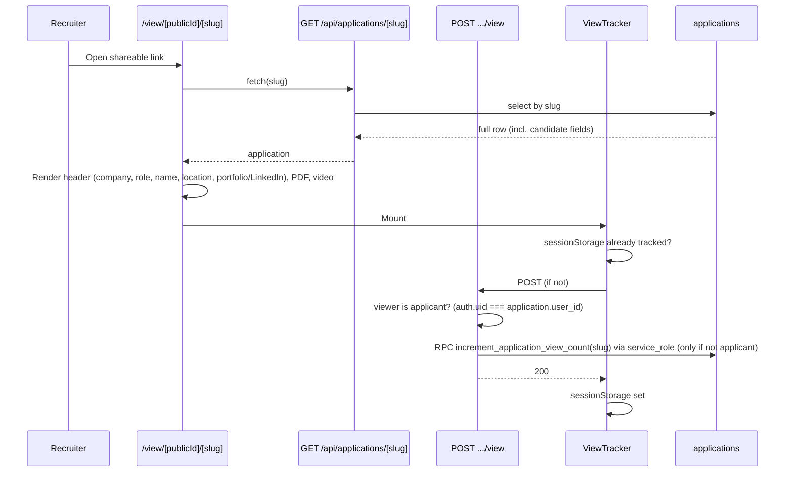

# MyHireView — Data Flow

This document describes how data moves through the system using Mermaid diagrams. For system architecture and design, see [ARCHITECTURE.md](ARCHITECTURE.md). For the full API catalog, see [API_REFERENCE.md](API_REFERENCE.md).

---

## Table of contents

- [1. High-level data flow](#1-high-level-data-flow)
- [2. Authentication](#2-authentication)
- [3. Profile (read and update)](#3-profile-read-and-update)
- [4. Create application](#4-create-application)
  - [Happy path overview](#happy-path-overview)
  - [4a. Page load](#4a-page-load)
  - [4b. Live slug feedback (while typing)](#4b-live-slug-feedback-while-typing)
  - [4c. Save](#4c-save)
  - [Notes](#notes)
- [5. Edit application](#5-edit-application)
  - [Happy path overview](#happy-path-overview-1)
  - [5a. Page load](#5a-page-load)
  - [5b. Live slug feedback (while editing)](#5b-live-slug-feedback-while-editing)
  - [5c. Save](#5c-save)
  - [Notes](#notes-1)
- [6. Public view and view count](#6-public-view-and-view-count)
- [7. Data ownership summary](#7-data-ownership-summary)
- [8. Create application — edge cases](#8-create-application--edge-cases)
  - [8.1 Slug: live resolution (auto mode)](#81-slug-live-resolution-auto-mode)
  - [8.2 Slug: live validation (manual mode)](#82-slug-live-validation-manual-mode)
  - [8.3 Slug: on Save (auto mode)](#83-slug-on-save-auto-mode)
  - [8.4 Slug: on Save (manual mode)](#84-slug-on-save-manual-mode)
  - [8.5 CV upload](#85-cv-upload)
  - [8.6 Candidate fields](#86-candidate-fields)
  - [8.7 Name in URL](#87-name-in-url)
  - [8.8 Rate limiting](#88-rate-limiting)
  - [8.9 Session / auth](#89-session--auth)
  - [8.10 Double-submit](#810-double-submit)

---

## 1. High-level data flow



- **Profiles** — Signup stores first/last name and opaque `public_id` in Auth `user_metadata` and inserts a `profiles` row (service role; idempotent retry on `/auth/callback`). Optional fields stay null until the user saves them. GET `/api/profile` is read-only (`404` if missing — rare). `/admin/profile` and `/admin/new` still seed from metadata if the row is missing.
- **Applications** are created/updated via the application form; candidate fields can come from the form (with toggles) or, on create, from a profile fallback when a row exists. Recruiters read only from the application row. Share URLs are `/view/{public_id}/{slug}`; slugs are unique per user, not globally.

---

## 2. Authentication



Sign-up works via `/api/auth/signup` with **first name, last name, email, password, and confirm password**. Names and `public_id` go into Auth `user_metadata`, and a `profiles` row is created (service role). Session is stored in cookies when issued; middleware refreshes it and protects `/admin` routes. Email confirmation uses `/auth/callback`, which also ensures the profiles row exists.

---

## 3. Profile (read and update)



Profile data is used as the default source for candidate fields when creating a new application; it is not updated from the application form. The row is normally created at signup; PUT merges with the existing row (picture-only updates are valid).

---

## 4. Create application

### Happy path overview

```mermaid
sequenceDiagram
  participant U as User
  participant Form as ApplicationForm
  participant SlugAPI as POST /api/slug
  participant UploadAPI as POST /api/upload
  participant AppsAPI as POST /api/applications
  participant DB as Database

  U->>Form: Open form; fill company, role, CV, video
  Form->>SlugAPI: POST company + role (debounced, auto)
  SlugAPI-->>Form: { slug } — shown in slug field ✓
  U->>Form: Click Save
  Form->>UploadAPI: POST PDF → get cv_url
  Form->>AppsAPI: POST (slug, cv_url, all fields)
  AppsAPI->>DB: insert application row
  AppsAPI-->>Form: 201
  Form->>U: Redirect to /admin
```

---

### 4a. Page load



---

### 4b. Live slug feedback (while typing)

The slug field is updated and validated automatically as the user types — no need to wait until Save.

**Auto slug** (default — user has not edited the slug field manually):



**Manual slug** (user edits the slug field directly):



---

### 4c. Save

```mermaid
sequenceDiagram
  participant U as User
  participant Form as ApplicationForm
  participant ValidateAPI as POST /api/slug/validate
  participant SlugAPI as POST /api/slug
  participant UploadAPI as POST /api/upload
  participant NewPage as /admin/new
  participant AppsAPI as POST /api/applications
  participant R2 as Cloudflare R2
  participant Profiles as profiles
  participant Applications as applications

  U->>Form: Click Save
  Form->>Form: validate required fields (company, role, slug, CV, video)
  alt auto slug — block if status is checking or unavailable
    Form->>U: show slug field error
  else manually edited — final race-condition check
    Form->>ValidateAPI: POST { slug }
    ValidateAPI-->>Form: { ok: true/false }
    alt not ok
      Form->>U: show slug field error
    end
  end
  Form->>UploadAPI: POST PDF (Idempotency-Key; skipped if CV unchanged)
  UploadAPI->>R2: PutObject
  R2-->>UploadAPI: cv_url
  UploadAPI-->>Form: cv_url
  Form->>NewPage: onSubmit(payload + slugManuallyEdited flag)
  alt slugManuallyEdited && available (already validated)
    NewPage->>NewPage: use typed slug directly
  else auto slug (or manual failed)
    NewPage->>SlugAPI: POST { company, role, slugNamePosition, first/last name? }
    SlugAPI->>Applications: checkSlugUniqueness(derivedSlug)
    alt available
      SlugAPI-->>NewPage: 200 { slug }
    else taken — no numeric suffix fallback
      SlugAPI-->>NewPage: 409 { error }
      NewPage->>U: show collision error (add name or change slug)
    end
  end
  NewPage->>AppsAPI: POST (slug, cv_url, company, role, candidate fields)
  AppsAPI->>AppsAPI: requireAuth()
  AppsAPI->>Profiles: select profile (candidate field fallback)
  Profiles-->>AppsAPI: profile row
  AppsAPI->>AppsAPI: merge body fields with profile fallback
  AppsAPI->>Applications: insert row
  Applications-->>AppsAPI: new row
  AppsAPI-->>NewPage: 201
  NewPage->>U: Redirect to /admin
```

---

### Notes

**Live slug feedback** — As the user fills in company, role, or changes the **Name in URL** preference, the form debounces a `POST /api/slug` call to check whether the derived slug is already taken. The slug field is updated with the result and a green or red status line appears immediately. When the user edits the slug field manually, the debounce instead calls `POST /api/slug/validate` (requires auth; checks format and uniqueness for that specific string).

**Slug on Save** — The form makes a final server-side check before submitting. For a **manually edited slug**, `POST /api/slug/validate` is called once more to prevent race conditions. The page then decides which slug to persist: if the typed slug passed format + validate it is used directly (no call to `POST /api/slug`); otherwise `POST /api/slug` (`reserveBaseSlug`) is called for the derived company/role slug. If that slug is taken the API returns **409** — no numeric suffix is appended, and the user is asked to add their name to the URL or change the slug.

**Candidate fields** — First name, last name, location, portfolio URL, and LinkedIn URL are sent from the form; toggles determine which are stored or set to null. If the client does not send them, the API falls back to the current profile. If the user chooses **Name in URL** (At start or At end), both the live slug call and the final save call include `slugNamePosition` and first/last name so the shareable link becomes `firstname-lastname-company-role` or `company-role-firstname-lastname`.

---

## 5. Edit application

### Happy path overview

```mermaid
sequenceDiagram
  participant U as User
  participant Form as ApplicationForm
  participant ValidateAPI as POST /api/slug/validate
  participant UploadAPI as POST /api/upload
  participant AppsAPI as PUT /api/applications
  participant DB as Database

  U->>Form: Open edit; change fields
  Form->>ValidateAPI: POST { slug, excludeId } (debounced)
  ValidateAPI-->>Form: { ok: true } — show green status ✓
  U->>Form: Click Save
  Form->>UploadAPI: POST PDF → get cv_url (if new file)
  Form->>AppsAPI: PUT (id, slug, cv_url, all fields)
  AppsAPI->>DB: update application row
  AppsAPI-->>Form: 200
  Form->>U: Redirect to /admin
```

---

### 5a. Page load



---

### 5b. Live slug feedback (while editing)

Every change to the slug field (or Name in URL toggle) triggers a debounced `POST /api/slug/validate`. The `excludeId` ensures the user's own current slug is not flagged as taken.



---

### 5c. Save

```mermaid
sequenceDiagram
  participant U as User
  participant Form as ApplicationForm
  participant ValidateAPI as POST /api/slug/validate
  participant SlugAPI as POST /api/slug
  participant UploadAPI as POST /api/upload
  participant EditPage as /admin/edit/[id]
  participant AppsAPI as PUT /api/applications
  participant R2 as Cloudflare R2
  participant Applications as applications

  U->>Form: Click Save
  Form->>Form: validate required fields (company, role, slug, CV, video)
  Form->>ValidateAPI: POST { slug, excludeId } — final race-condition check
  ValidateAPI-->>Form: { ok: true/false }
  alt not ok
    Form->>U: show slug field error, block submit
  end
  Form->>UploadAPI: POST PDF (Idempotency-Key; skipped if CV unchanged)
  UploadAPI->>R2: PutObject
  R2-->>UploadAPI: cv_url
  UploadAPI-->>Form: cv_url
  Form->>EditPage: onSubmit(payload with slug)
  alt slug or Name-in-URL preference changed vs stored value
    EditPage->>SlugAPI: POST { company, role, excludeId, slugNamePosition, first/last name? }
    SlugAPI->>Applications: checkSlugUniqueness(derivedSlug, excludeId)
    alt available
      SlugAPI-->>EditPage: 200 { slug }
    else taken — no numeric suffix fallback
      SlugAPI-->>EditPage: 409 { error }
      EditPage->>U: show collision error (add name or change slug)
    end
  end
  EditPage->>AppsAPI: PUT (id, resolved slug, cv_url, all fields)
  AppsAPI->>AppsAPI: requireAuth(), verify ownership
  AppsAPI->>AppsAPI: if cv_url changed, delete old R2 object
  AppsAPI->>Applications: update row (no profile merge)
  Applications-->>AppsAPI: updated row
  AppsAPI-->>EditPage: 200
  EditPage->>U: Redirect to /admin
```

---

### Notes

**Live slug feedback** — Every change to the slug field triggers a debounced `POST /api/slug/validate` (requires auth). The `excludeId` parameter ensures the application's own current slug is never flagged as taken. A green or red status line appears in real time.

**Slug on Save** — The form makes a **final `POST /api/slug/validate`** (with `excludeId`) before uploading the CV. This catches any race where the slug became taken between the last debounced check and clicking Save. If the slug or **Name in URL** preference changed relative to what was stored, the edit page then calls `POST /api/slug` (`reserveBaseSlug`) with `excludeId`. If that derived slug is taken by another application, the API returns **409** — no numeric suffix is appended.

**Profile table** — Only the application row is updated; the profile table is never written from the edit flow.

---

## 6. Public view and view count



All data shown to the recruiter (including candidate name, location, and links) comes from the application row. View count is incremented once per session via ViewTracker, and `last_viewed_at` is set to the current time, **except when the applicant (owner) is viewing their own application**—in that case the API returns success without updating so the count and last-viewed time reflect only external viewers. The increment is done via a SECURITY DEFINER database function callable only by the service role (see **docs/VIEW_COUNT_FIX.md**).

**CV download count:** When the recruiter (or any visitor) clicks "Download CV" in the PDF viewer, the client calls `POST /api/applications/[slug]/download` (once per session, via sessionStorage). The API increments `download_count` via the `increment_application_download_count` SECURITY DEFINER RPC (service_role only), only when the requester is not the application owner, so the count reflects only external CV downloads. The dashboard "View Insights" panel shows view count, CV download count, creation date, and last viewed date/time. The file name used for the download is chosen when creating or editing the application: either the original uploaded filename (e.g. `My Resume.pdf`) or the generated name `CV-{Slug}.pdf`, stored in `applications.cv_filename` and `applications.use_original_cv_filename`.

---

## 7. Data ownership summary

| Data        | Written by                    | Read by                          |
| ----------- | ----------------------------- | --------------------------------- |
| **profiles** | First `PUT /api/profile` (create); later profile page updates | Profile page; `/admin/new` prefill; applications API (create fallback when row exists) |
| **applications** | New/Edit form → `/api/applications` | Dashboard, edit page, public `/view/[publicId]/[slug]` |
| **auth**    | Login/signup → Supabase Auth  | Middleware, requireAuth(), profile/dashboard |

Candidate fields on the application are either supplied by the form (with toggles) or, on create only, taken from the profile when not in the request body. The recruiter view never reads from the profile table.

---

## 8. Create application — edge cases

### 8.1 Slug: live resolution (auto mode)

| # | Scenario | Behaviour |
|---|---|---|
| 1 | User types company/role quickly (faster than 450 ms) | Each keystroke resets the debounce timer; only the final value triggers `POST /api/slug`. Stale in-flight requests are cancelled via the `cancelled` flag. |
| 2 | User clears company or role | `slugLiveStatus` resets to `idle`; slug field retains its previous value but no availability indicator is shown. |
| 3 | Derived slug is available | `POST /api/slug` returns `{ slug }`; slug field is updated and green "This slug is available." appears. |
| 4 | Derived slug is already taken by another user | `POST /api/slug` returns 409; the derived (taken) slug is written into the slug field so the user can see what clashed, and a red collision message appears with suggestions (add name, change text). |
| 5 | `POST /api/slug` returns an unexpected 5xx | Red status "Could not reserve a slug. Try again." The derived slug is still written to the field. Save is blocked. |
| 6 | Network error during auto slug call | Same red status as 5xx above; form does not proceed. |
| 7 | User edits slug field manually mid-way through an in-flight auto slug call | `cancelled` flag is set; auto slug response is discarded. Manual validation mode takes over. |

### 8.2 Slug: live validation (manual mode)

| # | Scenario | Behaviour |
|---|---|---|
| 8 | User types invalid characters (e.g. uppercase, spaces, trailing hyphen) | `validateSlugFormat` fires immediately (no debounce, no network call); red error shown inline. |
| 9 | Slug exceeds 128 characters | Same as above — format rejection, no network call. |
| 10 | User types a slug that is already taken | `POST /api/slug/validate` returns `{ ok: false }`; red collision message shown. |
| 11 | User types a slug that is available | Green "This slug is available." shown. |
| 12 | Session expires while user is filling the form | `POST /api/slug/validate` returns 401; red "Sign in again to check slug availability." shown. |
| 13 | User toggles Name in URL (None → At start/end → None) | `slugManuallyEdited` is reset to `false`; auto slug mode re-activates and `POST /api/slug` fires again from the current company/role values. |

### 8.3 Slug: on Save (auto mode)

| # | Scenario | Behaviour |
|---|---|---|
| 14 | User clicks Save while slug is still `checking` | Form blocks submit: "Please wait until the slug has finished updating." |
| 15 | User clicks Save while slug is `unavailable` | Form blocks submit with the current unavailable message. |
| 16 | User clicks Save while slug is `available` | Form proceeds to CV upload and then `onSubmit`. The page calls `reserveSlugFromRole()` as a final check; if the slug became taken in the interim (race), 409 is surfaced via `alert()`. |
| 17 | `POST /api/slug` returns 409 at save time (race condition) | `alert()` shows the collision message. The application is **not** created. The user must change the slug or add their name. |
| 18 | `POST /api/slug` returns an empty or malformed `slug` field on 200 | `throw new Error("Failed to generate slug")` → `alert()`. Application not created. |

### 8.4 Slug: on Save (manual mode)

| # | Scenario | Behaviour |
|---|---|---|
| 19 | Manual slug is valid and passes `POST /api/slug/validate` at save time | Used directly; `POST /api/slug` is **not** called. |
| 20 | Manual slug has invalid format at save time | Form blocks submit with the format error message. |
| 21 | Manual slug is taken at save time (race: became taken between last debounce check and Save) | Form blocks submit with collision message; `POST /api/slug` is **not** called. |
| 22 | Manual slug fails validate (taken) and fallback `POST /api/slug` also returns 409 | `alert()` shows the collision message. Application not created. User must act on both their typed slug and the derived slug being taken. |
| 23 | Manual slug is invalid format and `reserveSlugFromRole()` also 409s | `alert()` shows the derived slug's collision message. |

### 8.5 CV upload

| # | Scenario | Behaviour |
|---|---|---|
| 24 | User selects a file, saves, then selects the same file again before the next save | Upload is deduplicated via file signature (`name:size:lastModified`); the cached R2 URL is reused — no duplicate upload. |
| 25 | User selects a file, save fails (e.g. slug error), then retries save | The same idempotency key is reused; R2 `PutObject` is idempotent so no duplicate object is created. |
| 26 | User selects a different file before retrying | A new idempotency key is generated; the old cached upload is invalidated. |
| 27 | Upload to R2 fails | `setErrors({ cv_url: error || "Upload failed" })`; submit halts before slug resolution. Application not created. |
| 28 | User provides a `cv_url` directly (e.g. existing URL on edit) rather than selecting a file | No upload is triggered; the existing URL is passed as-is. |

### 8.6 Candidate fields

| # | Scenario | Behaviour |
|---|---|---|
| 29 | User has no profile row yet (signup insert failed) | GET `/api/profile` → **404**; profile page and `/admin/new` seed names from Auth `user_metadata`; `getProfileSnapshot` returns all-null fields — create trusts client body from the form. Auth callback / next PUT can create the row. |
| 30 | User disables all candidate toggles | All candidate fields sent as `null`; the recruiter view shows no name, location, or links. |
| 31 | User enables name toggle but leaves first/last name blank | `trim() || null` evaluates to `null`; stored as null in DB. |
| 32 | User enables Name in URL with position `start` or `end` but has no first or last name | `buildSlug` / `reserveBaseSlug` falls back to company-role only (name segment is omitted). The slug does not include a name even though the preference is set. |

### 8.7 Name in URL

| # | Scenario | Behaviour |
|---|---|---|
| 33 | Two users create applications for the same company and role, both with no name in URL | The second user gets a 409 on `POST /api/slug`. They must add their name or choose a different slug — no automatic suffix is appended. |
| 34 | User A uses name in URL; User B does not (same company/role) | Slugs are structurally different (`john-doe-volvo-engineer` vs `volvo-engineer`); no collision. |
| 35 | User has first name only (no last name) and chooses Name in URL | `buildSlug` uses only the first name segment; e.g. `john-volvo-engineer`. |

### 8.8 Rate limiting

| # | Scenario | Behaviour |
|---|---|---|
| 36 | Client exceeds 60 requests/minute (IP-based) on any API route | Any of `POST /api/slug`, `POST /api/slug/validate`, `POST /api/applications` returns 429 with `Retry-After` header. Live status shows a generic error or the error propagates via `alert()`. |
| 37 | Rate limit store is in-memory (not shared across serverless instances) | On multi-instance deployments (e.g. Vercel), the limit is per-instance not global; a single client could bypass it by hitting different instances. Accepted limitation. |

### 8.9 Session / auth

| # | Scenario | Behaviour |
|---|---|---|
| 38 | Session expires between page load and Save | `POST /api/applications` returns 401; `alert()` shown, application not created. |
| 39 | User opens the create form, session expires, then types company/role | Auto slug `POST /api/slug` has no auth, so the availability check still works. The 401 only surfaces at Save when `POST /api/applications` is called. |
| 40 | User opens the create form, session expires, then manually edits the slug | `POST /api/slug/validate` requires auth → 401 → red "Sign in again to check slug availability." |

### 8.10 Double-submit

| # | Scenario | Behaviour |
|---|---|---|
| 41 | User clicks Save twice quickly | `isSubmittingRef` guard prevents the second call from entering the submit handler while the first is in flight. |
