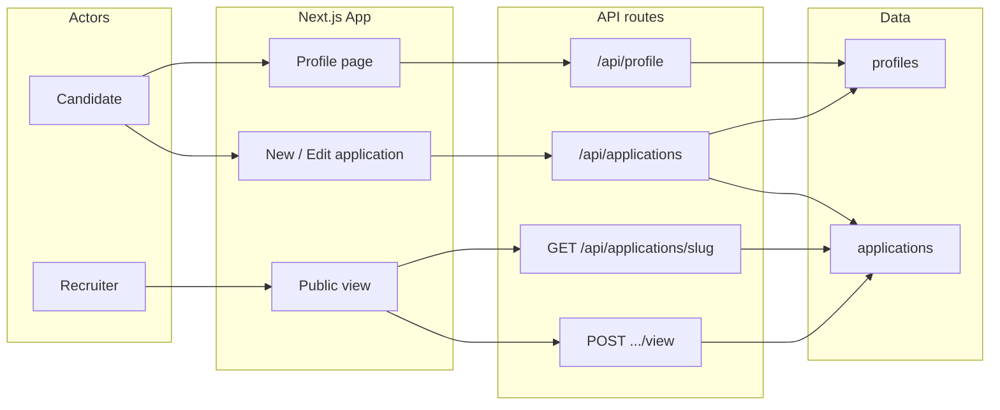
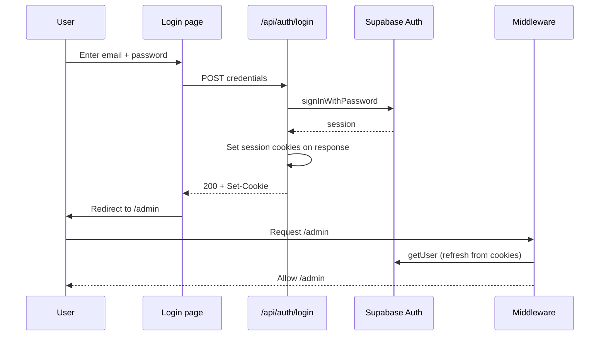
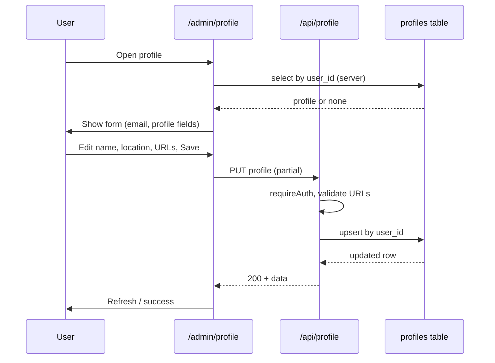
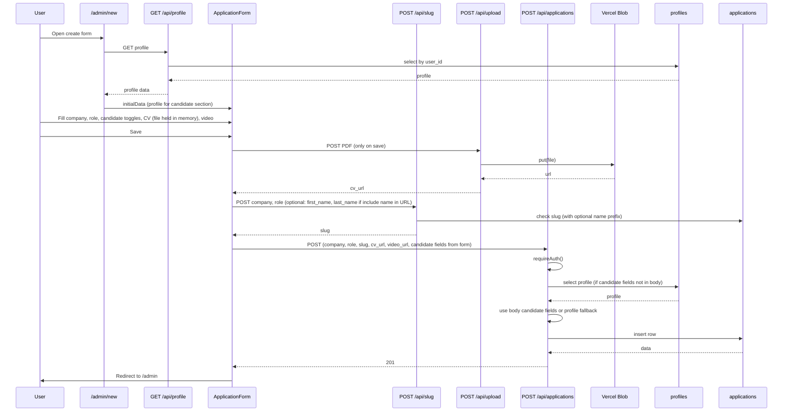
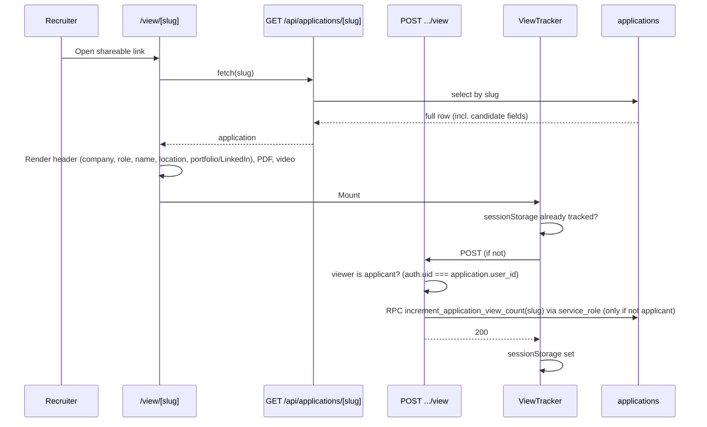

# HireView — Data Flow

This document describes how data moves through the system using Mermaid diagrams. For system architecture and design, see [ARCHITECTURE.md](ARCHITECTURE.md).

---

## 1. High-level data flow



- **Profiles** are read/updated only via the profile page and `/api/profile`.
- **Applications** are created/updated via the application form; candidate fields can come from the form (with toggles) or, on create, from a profile fallback. Recruiters read only from the application row.

---

## 2. Authentication



Sign-up works the same way via `/api/auth/signup`. Session is stored in cookies; middleware refreshes it and protects `/admin` routes.

---

## 3. Profile (read and update)



Profile data is used as the default source for candidate fields when creating a new application; it is not updated from the application form.

---

## 4. Create application



Candidate fields (first name, last name, location, portfolio URL, LinkedIn URL) are sent from the form; toggles determine which are stored or set to null. If the client does not send them, the API falls back to the current profile. If the user chooses **Name in URL** (At start or At end), the slug API is called with `slugNamePosition` and first/last name so the shareable link can be `firstname-lastname-company-role` or `company-role-firstname-lastname`.

---

## 5. Edit application

```mermaid
sequenceDiagram
  participant U as User
  participant EditPage as /admin/edit/[id]
  participant ByIdAPI as GET /api/applications/by-id/[id]
  participant Form as ApplicationForm
  participant AppsAPI as PUT /api/applications
  participant Applications as applications

  U->>EditPage: Open edit
  EditPage->>ByIdAPI: GET by id
  ByIdAPI->>Applications: select by id, user_id
  Applications-->>ByIdAPI: application (incl. candidate fields)
  ByIdAPI-->>EditPage: data
  EditPage->>Form: initialData from application only

  U->>Form: Change fields, toggles, optionally new CV file, Include name in URL, Save
  Note over Form: If new CV selected: upload to /api/upload on save, then PUT with new cv_url
  Form->>AppsAPI: PUT (id, all fields including candidate)
  Note over Form,Applications: If slug changed, slug API called with company, role, optional first/last name
  AppsAPI->>AppsAPI: requireAuth(), verify ownership; if cv_url changed, delete old blob
  AppsAPI->>Applications: update row (no profile merge)
  Applications-->>AppsAPI: data
  AppsAPI-->>Form: 200
  Form->>U: Redirect to /admin
```

Only the application row is updated; the profile table is never written from the edit flow.

---

## 6. Public view and view count



All data shown to the recruiter (including candidate name, location, and links) comes from the application row. View count is incremented once per session via ViewTracker, and `last_viewed_at` is set to the current time, **except when the applicant (owner) is viewing their own application**—in that case the API returns success without updating so the count and last-viewed time reflect only external viewers. The increment is done via a SECURITY DEFINER database function callable only by the service role (see **docs/VIEW_COUNT_FIX.md**).

**CV download count:** When the recruiter (or any visitor) clicks "Download CV" in the PDF viewer, the client calls `POST /api/applications/[slug]/download` (once per session, via sessionStorage). The API increments `download_count` via the `increment_application_download_count` SECURITY DEFINER RPC (service_role only), only when the requester is not the application owner, so the count reflects only external CV downloads. The dashboard "View Insights" panel shows view count, CV download count, creation date, and last viewed date/time. The file name used for the download is chosen when creating or editing the application: either the original uploaded filename (e.g. `My Resume.pdf`) or the generated name `CV-{Slug}.pdf`, stored in `applications.cv_filename` and `applications.use_original_cv_filename`.

---

## 7. Data ownership summary

| Data        | Written by                    | Read by                          |
| ----------- | ----------------------------- | --------------------------------- |
| **profiles** | Profile page → `/api/profile` | Profile page; applications API (create fallback) |
| **applications** | New/Edit form → `/api/applications` | Dashboard, edit page, public `/view/[slug]` |
| **auth**    | Login/signup → Supabase Auth  | Middleware, requireAuth(), profile/dashboard |

Candidate fields on the application are either supplied by the form (with toggles) or, on create only, taken from the profile when not in the request body. The recruiter view never reads from the profile table.
