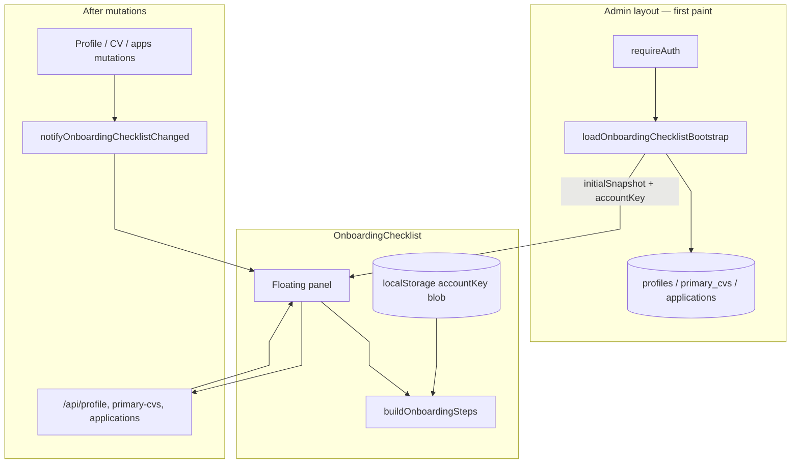
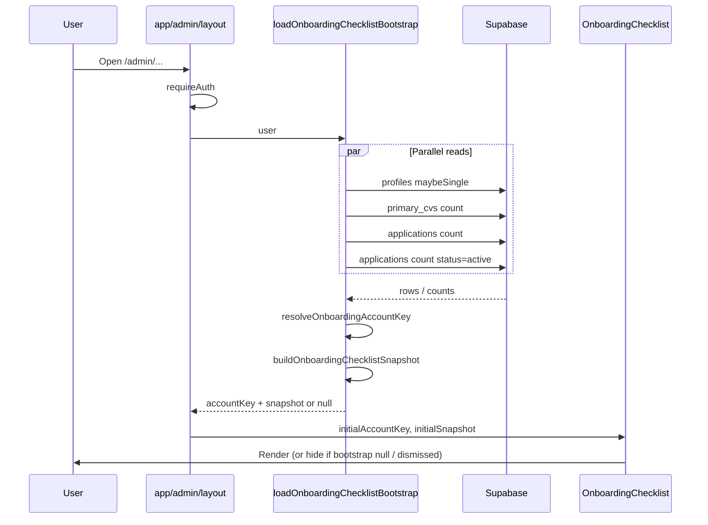
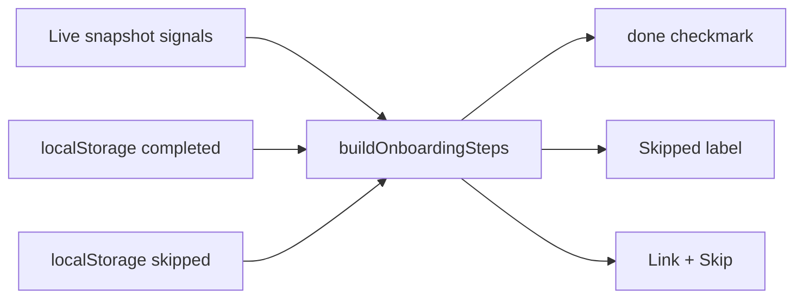
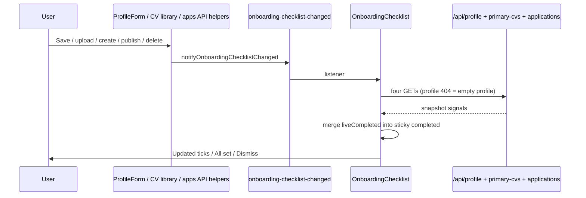

# Getting started checklist — data flow (F19-044)

How the floating **Getting started** checklist loads, updates, and persists across `/admin` routes. For the wider app data model, see [DATA_FLOW.md](DATA_FLOW.md). Manual checks: [MANUAL_TEST_ONBOARDING_CHECKLIST.md](manual-testing/MANUAL_TEST_ONBOARDING_CHECKLIST.md). Product copy: [USER_GUIDE.md](USER_GUIDE.md).

---

## Table of contents

- [1. Overview](#1-overview)
- [2. First paint (server bootstrap)](#2-first-paint-server-bootstrap)
- [3. Step satisfaction (live + sticky + skip)](#3-step-satisfaction-live--sticky--skip)
- [4. Browser prefs (`localStorage`)](#4-browser-prefs-localstorage)
- [5. Live refresh after mutations](#5-live-refresh-after-mutations)
- [6. Dismiss and account boundaries](#6-dismiss-and-account-boundaries)
- [7. Key files](#7-key-files)

---

## 1. Overview

The checklist is a **client** panel mounted from the **admin layout**. It is not a separate page.

| Concern | Source of truth |
| --- | --- |
| Whether a step is *currently* true in the product | Live account data (`profiles`, `primary_cvs`, `applications`) |
| Sticky “already completed once” / skips / dismiss / expand | Browser `localStorage` blob scoped by **account key** |
| First paint snapshot | Server loader in admin layout (Supabase direct — **no** `/api/*` GETs) |
| Refresh after save / upload / publish | Browser event → client refetch via `/api/*` |

Six steps (ids): `create_profile` → `finish_profile` → `photo` → `primary_cv` → `first_application` → `publish_share`.



---

## 2. First paint (server bootstrap)

On any `/admin/*` request that renders the layout, the server loads a checklist **bootstrap** once and passes it into the client component. That avoids four rate-limited `/api` GETs competing with the dashboard, profile, and create/edit pages.



When the layout later re-renders with a new bootstrap (for example after `router.refresh()`), the panel **copies** those props into React state. A failed notify-triggered `/api` load can therefore recover on the next successful bootstrap instead of staying blank or stale.

**Account key** (prefs scope), in order:

1. `profiles.public_id` when present  
2. else Auth `user_metadata.public_id`  
3. else `user:{authUserId}` (covers missing profiles row)

Missing profiles row → empty name/photo fields in the snapshot; **Create your profile** stays incomplete until PUT creates/saves the row.

If bootstrap fails, the client may fall back to one `/api` load; otherwise it stays hidden.

---

## 3. Step satisfaction (live + sticky + skip)

Pure helpers in `lib/utils/onboarding-checklist.ts` decide UI state:

| Step | Live “done” when |
| --- | --- |
| Create your profile | Non-empty first + last name |
| Add location or a link | Any of location / LinkedIn / portfolio |
| Add a profile photo | Non-empty `profile_picture_url` |
| Upload a primary CV | `primaryCvCount ≥ 1` |
| Create your first application draft | `applicationTotal ≥ 1` |
| Publish & share | `activeApplicationCount ≥ 1` |

A step shows as **completed** if live done **or** the id is in sticky `completed[]`.  
It shows as **skipped** only if not completed and the id is in `skipped[]`.  
Progress / **All set** counts completed **or** skipped.



When live data later goes away (e.g. delete the only published app), sticky `completed` keeps the tick for that **account key** in this browser.

---

## 4. Browser prefs (`localStorage`)

Single key: `myhireview:onboarding-checklist`.

```json
{
  "accountKey": "…",
  "completed": ["publish_share"],
  "skipped": ["photo"],
  "dismissed": false,
  "expanded": true
}
```

- Mismatched `accountKey` → defaults (fresh checklist for a new account on the same browser).  
- Legacy field `publicId` is still accepted when reading.  
- Older multi-key prefs (`…-skipped`, `…-completed`, `…-dismissed`, `…-expanded`) are **migrated once** into this blob for the current account key, then removed.  
- Expand / skip / sticky complete / dismiss all write this blob.

---

## 5. Live refresh after mutations

Client navigation and window focus do **not** refetch checklist counts. After a successful mutation that can change a step, the app dispatches `myhireview:onboarding-checklist-changed`; the panel refetches via APIs and merges any new live completions into sticky `completed`.



Notify call sites include (non-exhaustive): `ProfileForm`, `ProfilePictureModal`, `PrimaryCvLibrarySection`, `app/admin/new` create success, and `lib/api/applications` publish / restore / archive / delete.

---

## 6. Dismiss and account boundaries

- While any step is still open: footer **Skip all** (marks every step skipped; panel stays open → footer becomes **Dismiss**).  
- When every step is satisfied (done or skipped): footer **Dismiss** sets `dismissed: true` and hides the panel for that account key.  
- Delete + recreate (new public id / user id) → new account key → prefs do not carry over.

---

## 7. Key files

| File | Role |
| --- | --- |
| `app/admin/layout.tsx` | Auth + bootstrap props into the panel |
| `lib/utils/load-onboarding-checklist-snapshot.ts` | Server Supabase bootstrap |
| `components/admin/OnboardingChecklist.tsx` | UI, prefs, mutation refetch |
| `lib/utils/onboarding-checklist.ts` | Step definitions + progress |
| `lib/utils/onboarding-checklist-storage.ts` | `localStorage` parse/read/write + account key |
| `lib/utils/onboarding-checklist-sync.ts` | Browser event notify / subscribe |
