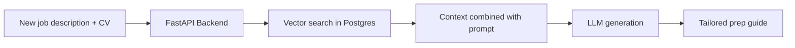

# AI-Powered Interview Preparation — Product Idea

A personalized, AI-driven interview preparation application that serves as a central knowledge repository for a user's career history, CV, and past interview Q&As. By leveraging Retrieval-Augmented Generation (RAG), the system cross-references historical data against newly uploaded job descriptions to generate tailored interview questions, context-aware answers, and customized cheat sheets.

---

## 1. Overview

**Goal:** Help candidates prepare for interviews with answers grounded in their own experience—not generic advice.

**How it works:**

1. The user stores their CV, achievements, and past interview Q&As in a secure vault.
2. When applying to a new role, they paste or upload a job description.
3. RAG retrieves the most relevant experience blocks from the vault.
4. An LLM generates tailored questions, suggested answers, and optional study materials.

---

## 2. Objectives & Value Proposition

| Objective | Description |
| --------- | ----------- |
| **Centralization** | Eliminate scattered documents by storing all career achievements and past interview responses in a single secure vault. |
| **Contextual personalization** | Move away from generic interview prep. Surface stories from the user's past that match the specific requirements of a new target role. |
| **Continuous improvement** | Establish a feedback loop where refined answers are saved back into the database, improving future generation cycles. |

---

## 3. Recommended Technical Architecture

### Tech stack

| Layer | Technology |
| ----- | ---------- |
| **Frontend** | Next.js (React), Tailwind CSS, TypeScript |
| **Backend API** | FastAPI (Python) |
| **Database** | PostgreSQL with pgvector extension |
| **AI / RAG** | LangChain or LlamaIndex |
| **LLM** | OpenAI API (GPT-4o) or Anthropic Claude 3.5 Sonnet |
| **Auth & hosting** | Supabase (Auth/Database), Vercel (Frontend), Render or AWS (Backend) |

### System data flow

---

## 4. Scope of Features

### Phase 1 — Core MVP

- **Profile management** — Upload and parse a master CV/resume (PDF or markdown text).
- **Q&A vault** — Manual interface to log past interview questions and highly rated answers, structured around the STAR method.
- **Job ingestion** — Simple dashboard text area to paste a new job title and description.
- **RAG generator** — Pipeline that pulls the top 3–5 most relevant text blocks from the user's experience and feeds them into the LLM to generate 10 tailored interview questions and target answers.

### Phase 2 — Advanced features (post-MVP)

- **Interactive flashcards** — Study mode to practice generated questions with hidden answers.
- **One-page cheat sheet** — Automated, exportable summary featuring company values, key role requirements, and top matching personal stories.
- **Feedback optimization** — "Save changes" on any AI-generated response, immediately updating database embedding vectors for future use.

---

## 5. Preliminary Database Schema

To support the RAG workflow, the database requires three primary tables:

| Table | Purpose |
| ----- | ------- |
| **User profiles / documents** | Stores raw text and metadata of the user's CVs and portfolios. |
| **Q&A bank** | Stores individual question-and-answer blocks. |
| **Embeddings** | Stores vector arrays generated from Q&A blocks and CV chunks to enable semantic search via pgvector. |
